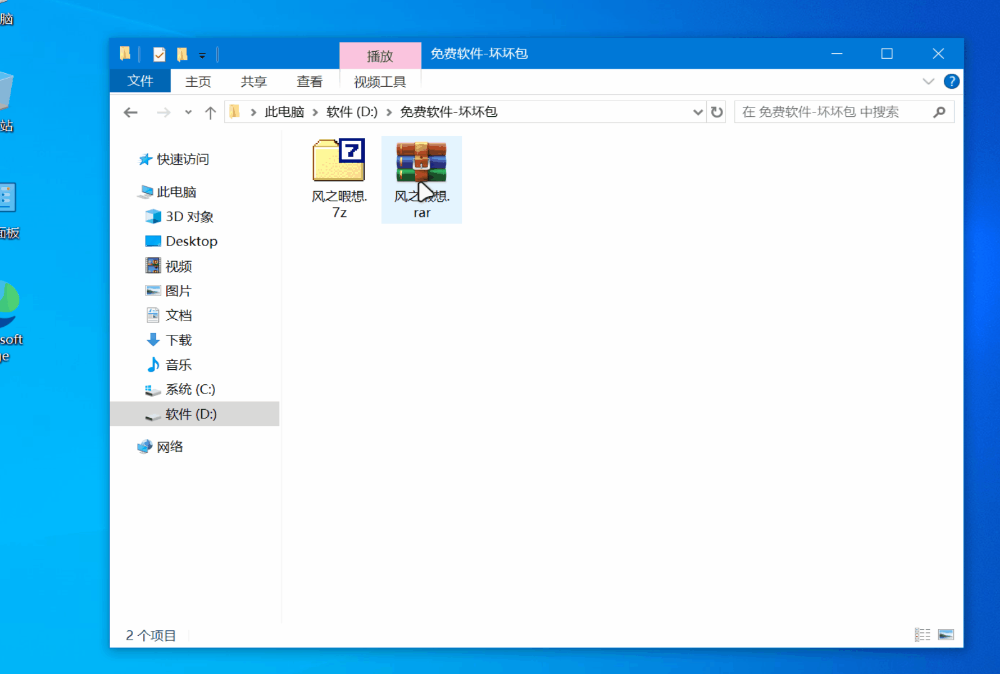

# NaughtyDamagePack

[**NaughtyDamagePack 坏坏包**](https://github.com/fzxx/NaughtyDamagePack)是一个让压缩包看起来像损坏的工具(**可还原**)，支持**极速**切换加密标记和数据破坏模式，适用于多种压缩格式。



## 特点

- 支持切换ZIP/RAR4压缩包的加密标记状态
- 对RAR5/7z/分卷压缩包采用数据破坏模式（再次处理可还原）
- 支持密钥文件增强破坏效果

## 支持格式

| 格式 | 处理方式 |
|------|----------|
| ZIP / RAR4 | 切换加密标记 |
| RAR5 / 7z / 分卷压缩包 | 数据破坏模式 |

## 使用方法

### 图形方式

- 将压缩包文件直接拖拽到本程序图标上，程序会自动处理并显示结果

### 命令行方式

```bash
NaughtyDamagePack [文件路径1] [文件路径2] ...
```

示例：
```bash
NaughtyDamagePack D:\txt.zip E:\docs.rar F:\video.7z
```

## 密钥文件

 - **可选**在程序同目录下**创建与程序同名**的`.hhbp.key`文件
   - 例如程序名为`NaughtyDamagePack.exe`，则密钥文件为`NaughtyDamagePack.hhbp.key`
 - **仅在破坏模式生效**，密钥文件内容任意，用于增强破坏效果，可当作快速的加密（**注重破坏而不是加密**）

## 处理方式

- **加密标记切换**：对于ZIP和RAR4格式，通过修改文件头中的加密标记，实现加密状态的切换
- **数据破坏模式**：对于RAR5/7z/分卷压缩包，通过在文件特定位置进行数据破坏，再次处理即可还原文件；对于RAR5添加了**少量恢复记录的压缩包也能实现破坏**。

## 更新日志

[更新日志](CHANGELOG.md)

## 注意事项

- 支持的最小文件是512字节；分卷压缩包只会处理当前指定的分卷文件
- 切换加密标记模式，理论上是可以跳过识别标记强制解压的
- **破坏模式算法**是**作者自实现**的，无任何标记**（防止识别）**，因此不会验证密钥是否正确，需要自己备份密钥文件；**能拦99.99%的破解者**，如需压缩包安全性请使用压缩包自带的AES加密
- 为了防止忘记压缩包是真损坏还是本软件破坏的，**请常用本软件或者自己做好记录**

## 相关项目

[想曰 - 文本加密让你想曰就曰](https://github.com/fzxx/XiangYue)

[文图变 - 文件藏到图片](https://github.com/fzxx/FileImgSwap)

## 下载地址

[https://github.com/fzxx/NaughtyDamagePack/releases](https://github.com/fzxx/NaughtyDamagePack/releases)
